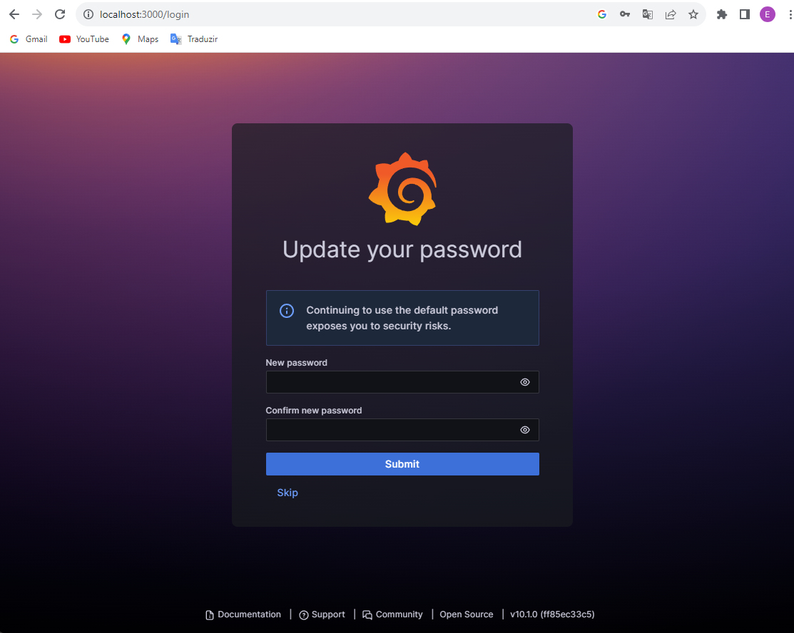

# Docker Compose
### Monitoring with 
- Grafana 10
- Prometheus 2.46
- Alertmanager 0.26
- Node-exporter 1.6.1
- Cadvisor 0.36
- Pushgateway 1.6.0
---
### Run
```
docker compose up -d
```
### Stop
```
docker compose down
```

---
### Steps Stack Monitoring
Access Grafana at http://localhost:3000 with User: admin and Password: admin


Set a new password for the administrator


Add new source data


Select Prometheus data source


Enter the http address (name) and port of the Prometheus service as configured in the docker-compose.yml file then click the Save and Test button


Now add a new dashboard


Add new visualization


As an example let's add the source "-- Grafana --"


You can get more information on how to create dashboard at: https://grafana.com/docs/grafana/latest/getting-started/build-first-dashboard/


To access Phometheus just go to url http://localhost:9090


To access Alertmanager just go to url http://localhost:9093


To access Node-Exporter just go to url http://localhost:9100


To access cAdvisor just go to url http://localhost:8080


To access Pushgateway just go to url http://localhost:9091


